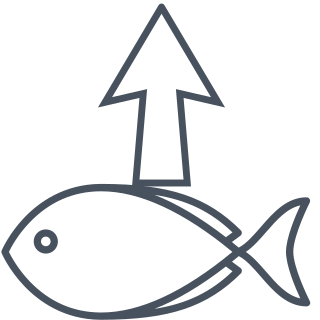

# UpFish

  
  

## What is UpFish?

UpFish is a Chrome extension that allows you to modify the audio of your
streaming movies.

## What can UpFish do?

Out of the box, UpFish can:

  - Turn "[Harry Potter and the Sorcerer's Stone][]" into
    "[Wizard People, Dear Reader][]", in which Harry and friends swear and
    drink a lot
  - Turn "[Vertigo][]" into "Fartigo", in which Jimmy Stewart farts a lot
  - Perform a generic karaoke filter

If you can write a little JSON, you can make UpFish do other things, too!

[Harry Potter and the Sorcerer's Stone]: https://en.wikipedia.org/wiki/Harry_Potter_and_the_Philosopher%27s_Stone_(film)
[Wizard People, Dear Reader]: https://en.wikipedia.org/wiki/Wizard_People,_Dear_Reader
[Vertigo]: https://en.wikipedia.org/wiki/Vertigo_(film)

## Quick Links

 - Install via Chrome WebStore - Pending review by Google!
 - [Source code on GitHub](https://github.com/joeyparrish/upfish/)
 - [Contribute!](https://github.com/joeyparrish/upfish/blob/main/CONTRIBUTE.md)

## Why is it called "UpFish"?

I wanted to name it after something from "Wizard People",
but "Viacom" was already taken,
and "Necrobenimbloalaphasagoso" was almost too long to tweet.

## Customization

You can create and publish your own configurations, and adapt movies any way
you want.  You can:

 - Independently control the volume of each audio channel
 - Choose between or mix karaoke-filtered and original audio
 - Choose different processing for stereo and surround sound
 - Add extra audio tracks to be synchronized with the movie
 - Control the volume and mixing of everything
 - Adjust volume and mixing dynamically over time

For details on customization, see documentation on the config file format in
[docs/config.md](https://github.com/joeyparrish/upfish/blob/main/docs/config.md).

## Analytics & privacy

We will log the following data:

 - A count of the number of installations
 - A count of the number of sessions

_**No** personally identifiable information will be read, collected, or stored._

The count of installations and sessions is publicly visible as dynamic badge at
the top of this README.

If you do not wish to participate in this, you can build the extension and
install it yourself.  Only the official version in the Chrome WebStore will
have analytics enabled.

## License

UpFish is licensed under the
[GPL v3](https://www.gnu.org/licenses/gpl-3.0.en.html).

## Building and installing from source

For instructions to build the extension from source, see
[docs/building.md](https://github.com/joeyparrish/upfish/blob/main/docs/building.md).

## Logo

The UpFish logo is based on
["Fish Outline SVG Vector"](https://www.svgrepo.com/svg/31355/fish-outline)
by ["SVG Repo"](https://www.svgrepo.com/)
(License: [CC0](https://www.svgrepo.com/page/licensing))
