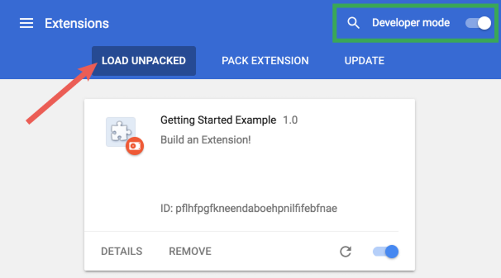

# UpFish


UpFish - Dynamically making fun of your movies.


## License

UpFish is licensed under the GPL v3.

https://www.gnu.org/licenses/gpl-3.0.en.html


## Why is it called "UpFish"?

I wanted to name the project after something from "Wizard People, Dear Readers".
It turned out that the name "Viacom" was already taken, and the name
"Necrobenimbloalaphasagoso" was almost too long to tweet.


## Logo

The UpFish logo is based on:
 - "Fish Outline SVG Vector" https://www.svgrepo.com/svg/31355/fish-outline
 - By: "SVG Repo" https://www.svgrepo.com/
 - License: CC0 https://www.svgrepo.com/page/licensing


## Analytics & privacy

We will log the following data:

 - A count of the number of installations
 - A count of the number of sessions

_**No** personally identifiable information will be stored._

The count of installations and sessions is publicly visible as dynamic badge at
the top of this README.

If you do not with to participate in this, you can build the extension and
install it yourself.  Only the official version in the Chrome WebStore will
have analytics enabled.


## Building and installing from source

To build the extension from source:

```sh
# Clone the source repo
git clone https://github.com/joeyparrish/upfish
# Enter the source directory
cd upfish
# Install the dependencies
npm install
# Build the extension from source
npm run build
```

Now the `dist/` folder contains an unpacked version of the extension, without
our analytics enabled.  To install this locally in Chrome, follow these
instructions.  (Taken from Chrome extension documentation at
https://developer.chrome.com/docs/extensions/mv3/getstarted/ under
[CC-BY-SA-4.0](https://creativecommons.org/licenses/by-sa/4.0/).)

> 1. Open the Extension Management page by navigating to `chrome://extensions`.
>    - Alternatively, open this page by clicking on the Extensions menu button
>      and selecting **Manage Extensions** at the bottom of the menu.
>    - Alternatively, open this page by clicking on the Chrome menu, hovering
>      over **More Tools** then selecting **Extensions**.
> 2. Enable Developer Mode by clicking the toggle switch next to **Developer
>    mode**.
> 3. Click the **Load unpacked** button and select the extension directory.  In
>    our case, this is the `dist/` folder within the source repo.
>
> 
>
> Ta-da!  The extension has been successfully installed.
