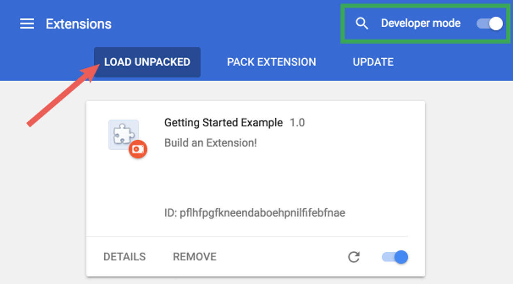

# Building UpFish from source

To build the extension from source:

```sh
# Clone the source repo
git clone https://github.com/joeyparrish/upfish
# Enter the source directory
cd upfish
# Install the dependencies
npm ci
# Build the extension from source
npm run build
```

Now the `dist/` folder contains an unpacked version of the extension, without
our analytics enabled.  To install this locally in Chrome, follow these
instructions.  (Taken from Chrome extension documentation at
https://developer.chrome.com/docs/extensions/mv3/getstarted/ under
[CC-BY-SA-4.0](https://creativecommons.org/licenses/by-sa/4.0/).)

> 1. Open the Extension Management page by navigating to `chrome://extensions`.
>    - Alternatively, open this page by clicking on the Extensions menu button
>      and selecting **Manage Extensions** at the bottom of the menu.
>    - Alternatively, open this page by clicking on the Chrome menu, hovering
>      over **More Tools** then selecting **Extensions**.
> 2. Enable Developer Mode by clicking the toggle switch next to **Developer
>    mode**.
> 3. Click the **Load unpacked** button and select the extension directory.  In
>    our case, this is the `dist/` folder within the source repo.
>
> 
>
> Ta-da!  The extension has been successfully installed.
