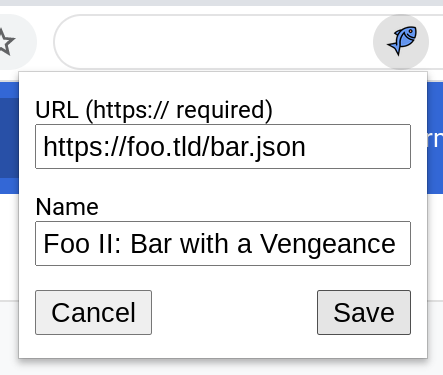

# UpFish Config Files


## Features

 - JSON config format
 - Supports stereo and 5.1 surround inputs
 - Karaoke filter for stereo inputs
 - Adjustable gain per channel, and over time
 - Mix in extra inputs synchronized to the original movie


## Overview

An UpFish config file has two main sections, one for stereo (called
`"stereo"`), and one for 5.1 surround sound (called `"surround"`).  These are
described in more detail below.

Most settings are just changing the gain of various audio channels.  All gain
settings follow the same format, which is described below.  Gain can be
adjusted over time if needed.

If you want to apply different gain levels to each channel, or if you want to
mix extra inputs into some channel other than the center, then you will need to
know the order of the channels.  Channel orders for stereo and surround are
detailed in the corresponding sections below.


## Gain Settings

Each gain setting can either specify a single value, to be applied to all
channels equally, or an array of values which will be applied to the various
channels.  For example, in stereo content, `[0.2, 0.6]` would set a gain of 0.2
on the left channel, and 0.6 on the right channel.  A single-value setting of
`0.3` would be equivalent to `[0.3, 0.3]`.

Each gain node has a default setting (field `"default"`), and an array of
overrides for specific time ranges (field `"map"`).  Each such override has a
start time (field `"start"`), an end time (field `"end"`), and a specific value
to apply during this time range (field `"value"`).  Any time the presentation
is not in a time range from the override map, the default setting is applied.
All times are in seconds.

The end of a time range is excluded from the range, and time ranges **must
not** overlap.

Example:

```json
{
  "stereo": {
    "inputGain": {
      "default": 0.2,
      "map": [
        {
          "comment": "Mute the audio completely during this range.",
          "start": 153.2,
          "end": 177.4,
          "value": 0
        },
        {
          "comment": "Mute the left channel only here.",
          "start": 181.9,
          "end": 199.0,
          "value": [0, 0.2]
        },
        {
          "comment": "Turn the right channel to full, but not the left.",
          "start": 211.2,
          "end": 216.6,
          "value": [0.2, 1]
        }
      ]
    }
  }
}
```


## Karaoke Mode (Stereo Only)


The input splits and goes two ways: one path goes through the karaoke filter,
and one goes around it.  Each of these paths has independent gain adjustments,
with the non-karaoke gain defaulting to 0.  You can switch back to the original
audio at any time by setting the karaoke gain to 0 and setting the non-karaoke
gain to 1.

You can also adjust the apparent strength of the karaoke filter by mixing the
two.  For example, you could set the karaoke gain to 0.8 and the non-karaoke
gain to 0.2 to _mostly_ remove the vocals in the center.

Stereo settings:

|setting       |default|
|--------------|-------|
|karaokeGain   |1      |
|nonKaraokeGain|0      |

Stereo channel order: left, right


## Surround Mode


The input is split into channels, each of which can have its gain set
independently.  The default setting is to mute the center channel only, which
is equivalent to the karaoke filter used in stereo mode.

Surround settings:

|setting  |default      |
|---------|-------------|
|inputGain|[1,1,0,1,1,1]|

5.1 surround channel order: front-left, front-right, center, low-freq effects,
side-left, side-right.


## Extra Inputs

To mix in extra inputs, add an `"extraInputs"` field inside `"stereo"` or
`"surround"` or both.  `"extraInputs"` is an array of input descriptors.  Each
input descriptor has an audio file URL (`"url"` field), a gain setting
(`"inputGain"` field), an array mapping input channels to output channels
(`"mix"` field), and a flag to specify a mono (1-channel) input (`"mono"`
field).

By default, extra inputs are mixed into the center channel in surround mode, or
the left and right channels in stereo mode.

Because we can't detect mono inputs programatically, the `"mono"` field must be
set to `true` for any 1-channel inputs.  When this flag is set, UpFish will
duplicate the input's contents into both left and right channels in stereo
mode.  Without this flag, mono inputs will only appear in the left channel of
stereo content.

The `offset` and `skip` fields are used to use subsets of clips and to position
them in specific places on the main content.  For example, an `offset` of 100
means that the extra audio will not start playing until the main content
reaches 1 minute and 40 seconds.  A `skip` of 20 means that the first 20
seconds of the _extra_ audio will be skipped when it starts playing.

Extra input settings:

|setting  |default                |
|---------|-----------------------|
|url      |(required - no default)|
|inputGain|1                      |
|mix      |[0, 1] in stereo mode  |
|mix      |[2, 2] in surround mode|
|mono     |false                  |
|offset   |0                      |
|skip     |0                      |


## Other notes

Changing gain values at particular times in the movie allows "ducking" to
silence voices that are not removed by the karaoke filter, or as an alternative
to the karaoke filter.  See also https://en.wikipedia.org/wiki/Ducking


## Example Config

This is a verbose example config with every field demonstrated.

```json
{
  "surround": {
    "inputGain": {
      "default": [1, 1, 0, 1, 1, 1]
      "map": [
        {
          "start": 123.4,
          "end": 127.9,
          "value": [1, 1, 0, 0, 0.2, 0.2]
        },
        {
          "start": 867.5309,
          "end": 1800.6492568,
          "value": [1, 1, 0, 0.8, 0, 0]
        }
      ],
    },
    "extraInputs": [
      {
        "url": "WizardPeople.mp3",
        "mono": true,
        "inputGain": {
          "default": 1.0
        },
        "mix": [2, 2]
      }
    ]
  },
  "stereo": {
    "karaokeGain": {
      "default": 0.1
      "map": [
        {
          "start": 123.4,
          "end": 127.9,
          "value": 0.05,
        },
        {
          "start": 867.5309,
          "end": 1800.6492568,
          "value": 0,
        }
      ],
    },
    "nonKaraokeGain": {
      "default": 0
    },
    "extraInputs": [
      {
        "url": "WizardPeople.mp3",
        "mono": true,
        "inputGain": {
          "default": 1.0
        },
        "mix": [0, 1]
      }
    ]
  }
}
```


## Adding a Custom Config to UpFish

Your custom config file should be hosted somewhere on the web.

For development purposes while you are writing and testing your config, a local
web server is a good place to start.  You can even use something like
`npx http-server` to quickly start a temporary node-based server on `localhost`
without installing anything.

To share your config with others, you will need to host it (and any extra audio
inputs) on an accessible public web server.  You can host static content easily
on the cloud storage provider of your choice, or even on
[GitHub Pages](https://pages.github.com/).

To add a custom config to UpFish, open the extension and click the "Add" button.


Next, fill in a name and the URL of the config file (from your local web server
or from a more permanent location), then click "Save".


Your custom config will now show up in the list of configs.

