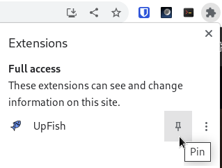
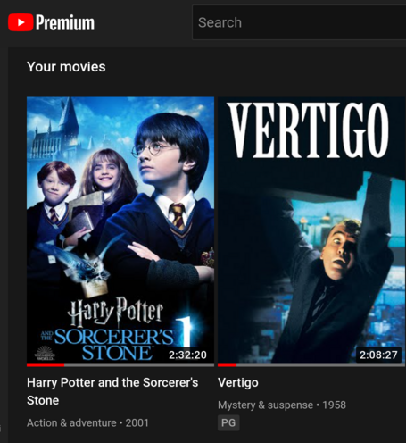
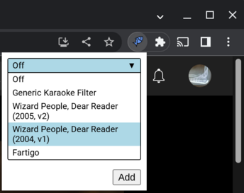
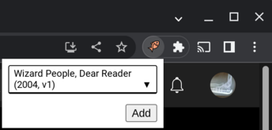

# UpFish Usage

After installing UpFish, you should pin the extension so that it is visible.

-----

You will need streaming access to the movies you want to modify.
Any streaming service is acceptable.
If the service injects server-side ads, sync may be lost, so purchased copies
of a movie are preferable.

-----

After loading the movie in a tab, click on the extension and select a config.

-----

When the extension is active on the current tab, the icon will be
salmon-colored.

-----

Navigating within a tab will deactivate the extension on that tab.
